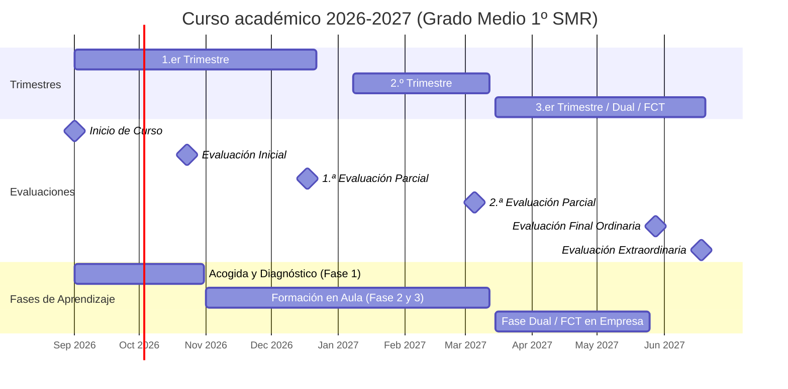
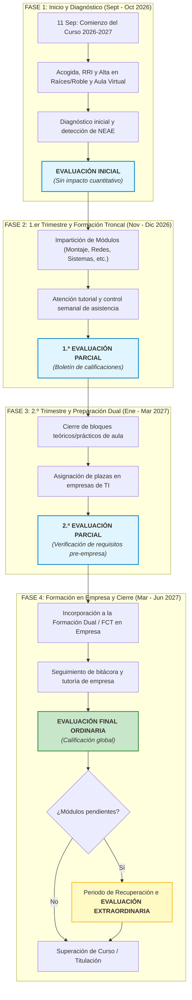

# Itinerario formativo y evaluaciones del curso 2026-2027

- **Centro:** IES Juan de la Cierva (Madrid)  
- **Familia Profesional:** Informática y Comunicaciones
- **Ciclo Formativo:** Grado Medio en Sistemas Microinformáticos y Redes (SMR)
- **Fecha de Inicio de Curso:** 11 de Septiembre de 2026
- **Marco Normativo:** Ley Orgánica 3/2022, Real Decreto 659/2023 y Orden 893/2022 (Comunidad de Madrid)

---

## 1. CRONOGRAMA DEL CURSO 2026-2027

---

## 2. ITINERARIO Y EVALUACIONES DEL CURSO 2026-2027

---

## 3. CUADRO RESUMEN DE HITOS ACADÉMICOS Y EVALUACIONES

| Hito / Evaluación | Periodo Estimado | Marco Normativo | Finalidad y Contenido Principal |
| :--- | :--- | :--- | :--- |
| **Inicio de Curso** | 11 de Septiembre de 2026 | Calendario Escolar CAM | Presentación del ciclo, Reglamento de Régimen Interior (RRI) y alta en plataformas (Raíces/Roble/Aula Virtual). |
| **Evaluación Inicial** | Finales de Octubre 2026 | RD 659/2023 | Detección de nivel formativo previo, hábitos de estudio y coordinación con el Departamento de Orientación (NEAE). |
| **1.ª Evaluación Parcial** | Mediados de Diciembre 2026 | Orden 893/2022 | Primera valoración cuantitativa de los Resultados de Aprendizaje (RA) y comunicación formal a familias. |
| **2.ª Evaluación Parcial** | Inicios de Marzo 2027 | Orden 893/2022 | Cierre del bloque lectivo intensivo de aula y comprobación de aptitud para el acceso a empresa. |
| **Fase Dual / FCT** | Marzo – Mayo/Junio 2027 | LO 3/2022 / RD 659/2023 | Estancia en empresas del sector informático (soporte microinformático, montaje y redes). |
| **Evaluación Final Ordinaria** | Finales de Mayo / Inicios de Junio 2027 | Orden 893/2022 | Evaluación global del curso lectivo, integrando los módulos de aula y la estancia en empresa. |
| **Evaluación Extraordinaria** | Mediados de Junio 2027 | Orden 893/2022 | Pruebas y actividades de recuperación para alumnado con módulos no superados en la ordinaria. |

---

## 4. CONTROL DE ASISTENCIA Y MATRÍCULA

| Tipo de Medida | Umbral de Faltas / Causa | Efecto Administrativo / Académico | Procedimiento y Competencia |
| :--- | :--- | :--- | :--- |
| **Aviso Preventivo** | ~10% de faltas lectivas acumuladas | Apercibimiento formal por escrito | Notificación por Roble/Raíces emitida por el Tutor/a a las familias. |
| **Pérdida de Evaluación Continua** | 15% – 20% de faltas lectivas del módulo | Mantiene la matrícula y asistencia. Pierde pruebas parciales y realiza examen final/global. | Aplicación según Criterios de la Programación Didáctica / RRI. |
| **Anulación de Matrícula de Oficio** | ≥ 15% de faltas injustificadas globales **O** 15 días lectivos consecutivos sin justificar | Pérdida definitiva de la plaza y de la condición de alumno (Art. 22 Orden 893/2022). | Tramitación por Jefatura de Estudios y Resolución firmada por Dirección del IES. |

---

## 5. JUSTIFICACIÓN DE AUSENCIAS

| Causa de la Ausencia | Documentación Oficial Requerida | Plazo de Entrega |
| :--- | :--- | :--- |
| **Enfermedad o Accidente** | Parte médico oficial de baja, justificante de urgencias o consulta médica. | Máximo 3 días lectivos tras la incorporación. |
| **Deber Inexcusable Público/Personal** | Citación judicial, justificante de trámite oficial (DNI, extranjería) o examen oficial. | Previo a la ausencia o al día siguiente. |
| **Atención a Familiares** | Justificante médico de atención o ingreso de familiar de 1.er grado. | Máximo 3 días lectivos tras la incorporación. |
| **Otras Causas Excepcionales** | Solicitud formal por escrito dirigida a Jefatura de Estudios. | Previo a la ausencia (salvo fuerza mayor). |
